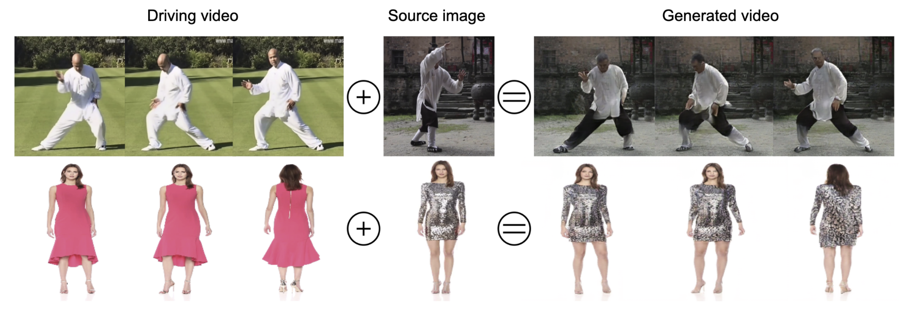
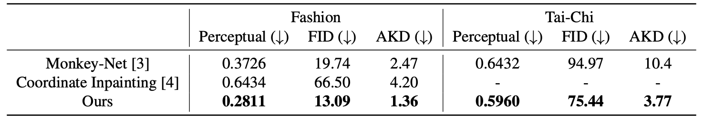

# DwNet

This is the code repository complementing the paper ["DwNet: Dense warp-based network for pose-guided human video generation"](https://arxiv.org/abs/1910.09139).  The pretrained models are included in the repo.


Teaser  |  Quantitive results evaluation.
:-------------------------:|:-------------------------:
 | 

## Dependencies and Setup

- Python 2.7.12
- [DensePose](https://github.com/facebookresearch/DensePose)
- numpy==1.15.0
- dominate==2.3.4
- torch==1.0.1.post2
- scipy==1.1.0
- matplotlib==2.2.3
- torchvision==0.2.1
- tensorflow_gpu==1.11.0
- Pillow==7.2.0
- tensorflow==2.2.0


## Experiments

### Datasets
All data in this project relies on the [DensePose](https://github.com/facebookresearch/DensePose)[1] output. For the source image and the driving video you would need to extract the DensePose estimation, which are essentially human pixels of an RGB image mapped to the 3D surface of the human body. You can find examples of this preproccessed data in the **datasets/** folder for Fashion and Tai-Chi datasets. Any video has to be saved as a separate folder of **.PNG** images (see the **datasets/**).

To install the DensePose I used their docker version described at the bottom [here](https://github.com/facebookresearch/DensePose/blob/master/INSTALL.md).

#### Fashion dataset
Videos for train and test can be downloaded from [here](https://vision.cs.ubc.ca/datasets/fashion/).

#### Tai-Chi dataset
To obtain this dataset please refer to the original source[2]. 

### Test
```bash
python test.py --name taichi_best  --dataroot datasets/taichi_test/  --gpu_ids 0 
```

To test the transfer between different videos:

```bash
python test.py --name taichi_best  --dataroot datasets/taichi_test/  --gpu_ids 0 --transfer --transfer_file ./datasets/taichi_pairs.csv
```

\-\-transfer_file points to a file with pairs of folders, where the first folder is a source for the frame to be transferred onto the driving video from the second column. Since we have just two examples in the test datasets, we only have two rows of pairs.


### Train 

To train from scratch you should use this command:
```bash
python train.py --name testing_taichi  --dataroot ../path/to/the/train/dataset --batchSize 8 --gpu_ids 0 

```

If you want to load a pretrained model then please use a flag \-\-load_pretrained:
```bash
python train.py --name testing_taichi  --dataroot ../path/to/the/train/dataset --batchSize 8 --gpu_ids 0 --load_pretrain checkpoints/taichi_best/
```

This would load the model that is included in the repo. 

### Acknowledgements

This implementation adapts a lot of code from the [Pix2PixHD[3]](https://github.com/NVIDIA/pix2pixHD).


### References

[1] Rıza Alp Güler, Natalia Neverova, Iasonas Kokkinos; Dense Human Pose Estimation In The Wild; https://arxiv.org/abs/1802.00434

[2] Sergey Tulyakov, Ming-Yu Liu, Xiaodong Yang, Jan Kautz; MoCoGAN: Decomposing Motion and Content for Video Generation; https://arxiv.org/pdf/1707.04993.pdf

[3] Ting-Chun Wang, Ming-Yu Liu, Jun-Yan Zhu, Andrew Tao, Jan Kautz, Bryan Catanzaro; High-Resolution Image Synthesis and Semantic Manipulation with Conditional GANs; https://arxiv.org/pdf/1711.11585.pdf
